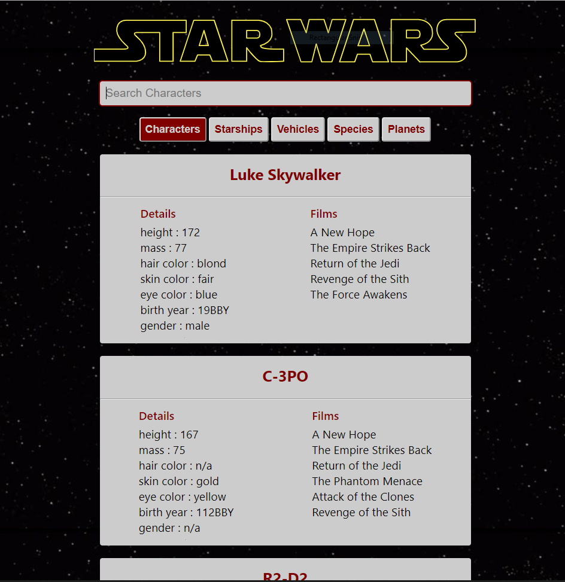
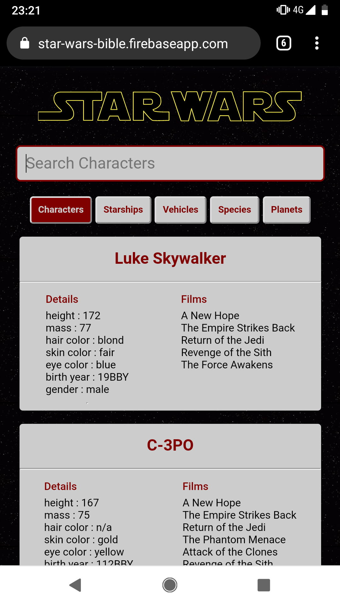

## Star Wars Bible

This project is a small search engine that uses the [swapi](https://swapi.co/) APIs to retrive informations about the Star Wars universe about the following types:

* Characters
* Starships
* Vehicles
* Species
* Planets

## Live Demo

You can try the production build here: [https://star-wars-bible.firebaseapp.com/](https://star-wars-bible.firebaseapp.com/ "Star Wars Bible")

## Desktop Layout



## Mobile Layout



## Tech Stack

The project was created with [Create React App](https://github.com/facebook/create-react-app) and uses both **React** and **Redux** hooks, **Styled Components**, **RxJS** (Redux Observables), **Jest** and **React Testing Library** for testing.

There is a full CI / CD pipeline in place using **Circleci** which deploys to **Firebase**.

All the heavy lifting for the async functionality (real time filtering, infinite scrolling, etc) is done with these 3 **Redux Observables** Epics (along with some utility classes):

```javascript
const bootstrapEpic = (action$, state$, { getData }) => action$.pipe(
    ofType(BOOTSTRAP_APPLICATION),
    switchMap(() =>
        concat(
            of(scrollEventListener()),
            of(fetchDataInProgress(true)),
            getData(API_END_POINTS[state$.value.data.searchType]).pipe(
                retry(3),
                timeout(REQUEST_TIMEOUT),
                switchMap(films =>
                    concat(
                        of(setSearchType(SEARCH_CATEGORIES['Characters'])),
                        of(bootstrapDataCompleted(sortedFilms(films.response.results)))
                    )
                ),
                catchError(() => of(bootstrapDataError(true)))
            )
        )
    )
);
```
*bootstrapEpic.js*

```javascript
const fetchDataEpic = (action$, state$, { getData }) => action$.pipe(
    ofType(FETCH_DATA),
    debounceTime(350),
    switchMap(action =>
        concat(
            of(fetchDataInProgress(true)),
            getData(action.payload.url).pipe(
                retry(3),
                timeout(REQUEST_TIMEOUT),
                exhaustMap(search => of(fetchDataCompleted(search.response))),
                catchError(() => of(fetchDataError(true)))
            ),
            of(fetchDataInProgress(false))
        )
    )
);
```
*fetchDataEpic.js*

```javascript
const infiniteScrollEpic = (action$, state$) => action$.pipe(
    ofType(SCROLL_EVENT_LISTENER),
    switchMap(() =>
        fromEvent(window, 'scroll').pipe(
            throttleTime(400),
            filter(ev => shouldLoadMore(ev, state$.value.data.next, state$.value.data.isFetchingInProgress)),
            map(() => fetchData({
                url: state$.value.data.next,
                fromSearch: false
            }))
        )
    )
);
```
*infiniteScrollEpic.js*
